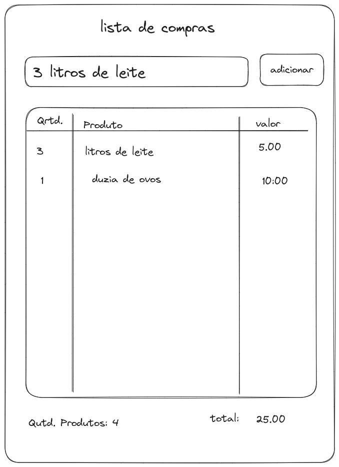

# Acompanhamento de validação de insígnias

O objetivo deste repositório é acompanhar a validação de insĩgnias dos educandos e mentorandos do PAQ [@zanotta23](https://github.com/zanotta23) e [@Petoteta](https://github.com/Petoteta).

Neste projetos validaremos insígnias de HTML/CSS, Javascript e Lógica de programação

## Sobre o projeto

O projeto que os educandos desenvolverão trata-se de uma lista de compras inteligente com os seguintes recursos.

- Adicionar itens usando linguagem natural (ex: 2 caixas de leite R$ 5,00 -> `quantidade: 2; produto: caixas de leite; valor_unitario: 5.00`)
- Totalizar a quantidade de produtos
- Calcular o valor total da lista de compras
- Excluir determinado item da lista de compras
- Limpar a lista de compras
- Armazenar a lista de compras no `local storage`

## Mockup da tela inicial

**Obs.:** Este mockup é apenas para a base do projeto, alterações serão feitas para contemplar todos os recursos que queremos implementar.

## Projeto no GitHub Pages

O projeto rodando no GitHub pages pode ser acessado por [aqui](https://thcerutti.github.io/acompanhamento-validacao-insignias/).
